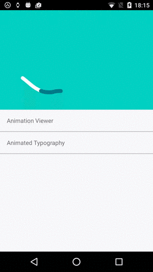

# Using Lottie with Xamarin Android and iOS

Lottie is a mobile library for Android and iOS that parses [Adobe After Effects](http://www.adobe.com/products/aftereffects.html) animations exported as json with [Bodymovin](https://github.com/bodymovin/bodymovin) and renders them natively on mobile!

    

## Sample App

You can build the sample app yourself. The app includes some built in animations but also allows you to load an animation from internal storage or from a url.

## Lottie supports

Lottie supports Android Jellybean (API 16) and above and iOS 8 and above

